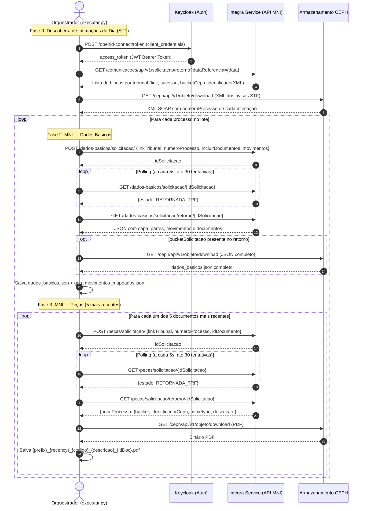
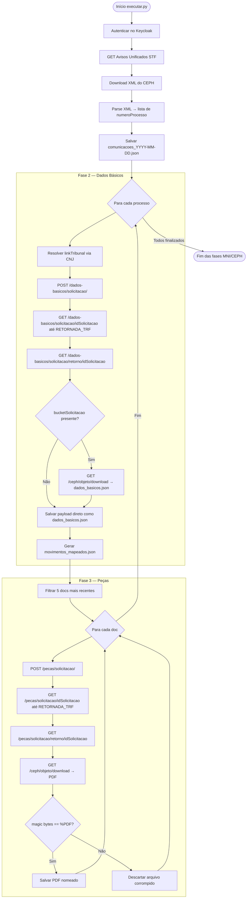

# Fluxo de Integração — MNI / CEPH

Documento de referência técnica das fases de integração com o Integra Service (Keycloak, Avisos Unificados, MNI e CEPH). Não cobre GCS, Google Drive nem SAJ McFly.

## Integração no Airflow local

O projeto agora inclui uma DAG manual chamada `integra_service_downloads` para processar um lote de processos a partir de um arquivo JSON configurado por ambiente.

### Variáveis esperadas no .env

- `INTEGRA_CLIENT_ID`
- `INTEGRA_CLIENT_SECRET`
- `INTEGRA_KC_BASE_URL`
- `INTEGRA_SERVICE_BASE_URL`
- `INTEGRA_KC_REALM`
- `INTEGRA_JSON_PATH`
- `INTEGRA_DOWNLOADS_DIR`
- `INTEGRA_RUNS_DIR`

### Formato do arquivo de entrada

O arquivo apontado por `INTEGRA_JSON_PATH` pode ser um array JSON ou um objeto com a lista `processos`.

Exemplo:

```json
[
  {"numero_processo": "123", "link_tribunal": "STF"}
]
```

### Como executar

1. Copie [.env.example](.env.example) para .env.
2. Preencha as credenciais do Integra Service.
3. Rode `docker compose up -d`.
4. Dispare a DAG `integra_service_downloads` no Airflow UI com os parâmetros desejados.

---

## Fases

### Fase 0 — Autenticação (Keycloak)

Obtém o Bearer Token via `client_credentials`. O token é reutilizado em todas as requisições subsequentes e renovado automaticamente em caso de `HTTP 401`.

**Endpoint:** `POST https://keycloak-integraservice.estaleiro.serpro.gov.br/realms/integra-realm/protocol/openid-connect/token`

```bash
curl -k -X POST \
  "https://keycloak-integraservice.estaleiro.serpro.gov.br/realms/integra-realm/protocol/openid-connect/token" \
  -d "grant_type=client_credentials" \
  -d "client_id={CLIENT_ID}" \
  -d "client_secret={CLIENT_SECRET}"
```

**Resposta:**
```json
{ "access_token": "eyJ...", "expires_in": 300, "token_type": "Bearer" }
```

**Extraindo e reutilizando o token (bash):**
```bash
TOKEN=$(curl -k -s -X POST \
  "https://keycloak-integraservice.estaleiro.serpro.gov.br/realms/integra-realm/protocol/openid-connect/token" \
  -d "grant_type=client_credentials" \
  -d "client_id={CLIENT_ID}" \
  -d "client_secret={CLIENT_SECRET}" \
  | python -c "import sys,json; print(json.load(sys.stdin)['access_token'])")

echo $TOKEN
```

A partir daí, todas as chamadas usam `-H "Authorization: Bearer $TOKEN"`.

---

### Fase 1 — Descoberta de Intimações

Consulta o unificador de avisos do Integra Service para a data de referência. Retorna uma lista de blocos por tribunal, cada um indicando se houve sucesso, o total de avisos e as referências ao XML armazenado no CEPH (bucket + identificador). O pipeline filtra apenas os blocos com `link == "STF"` e `sucesso == true`, baixa o XML do CEPH e extrai os números de processo.

**Endpoint:** `GET https://integraservice.pgfn/comunicacoes/api/v1/solicitacao/retorno`

```bash
curl -k -X GET \
  "https://integraservice.pgfn/comunicacoes/api/v1/solicitacao/retorno?dataReferencia=2026-07-22" \
  -H "Authorization: Bearer $TOKEN"
```

---

### Fase 2 — Dados Básicos MNI

Solicita a capa completa do processo: partes, movimentos e árvore de documentos. O fluxo é assíncrono em três passos: (1) solicitar → recebe `idSolicitacao`; (2) polling de status até `RETORNADA_TRF`; (3) obter retorno com os dados. Se o retorno indicar `bucketSolicitacao` + `identificadorCeph`, o JSON completo é baixado do CEPH; caso contrário, usa o payload do retorno direto.

**2.1 — Solicitar dados básicos**

`POST https://integraservice.pgfn/consulta-processual/api/v1/dados-basicos/solicitacao/`

```bash
curl -k -X POST \
  "https://integraservice.pgfn/consulta-processual/api/v1/dados-basicos/solicitacao/" \
  -H "Authorization: Bearer {TOKEN}" \
  -H "Content-Type: application/json" \
  -d '{
    "linkTribunal": "STF",
    "numeroProcesso": "50138738720234036100",
    "incluirDocumentos": true,
    "movimentos": true
  }'
```

**Resposta:** `"12345"` (idSolicitacao como string)

---

**2.2 — Consultar status**

`GET https://integraservice.pgfn/consulta-processual/api/v1/dados-basicos/solicitacao/{idSolicitacao}`

```bash
curl -k -X GET \
  "https://integraservice.pgfn/consulta-processual/api/v1/dados-basicos/solicitacao/12345" \
  -H "Authorization: Bearer {TOKEN}"
```

**Resposta:**
```json
{ "estado": "RETORNADA_TRF", "historicos": [...] }
```

Estados possíveis: `PENDENTE`, `PROCESSANDO`, `RETORNADA_TRF`, `ERRO_*`.

---

**2.3 — Obter retorno**

`GET https://integraservice.pgfn/consulta-processual/api/v1/dados-basicos/solicitacao/retorno/{idSolicitacao}`

```bash
curl -k -X GET \
  "https://integraservice.pgfn/consulta-processual/api/v1/dados-basicos/solicitacao/retorno/12345" \
  -H "Authorization: Bearer {TOKEN}"
```

**Resposta (resumida):**
```json
[{
  "numeroUnicoProcessoOrigem": "50138738720234036100",
  "classeProcessoSTF": "ARE",
  "numeroProcessoSTF": "1613984",
  "bucketSolicitacao": "integra-service-pgfn16-consulta-processual",
  "identificadorCeph": "dados-basicos/12345.json",
  "documento": [...],
  "movimento": [...]
}]
```

---

**2.4 — Download do JSON completo do CEPH** *(quando `bucketSolicitacao` presente)*

`GET https://integraservice.pgfn/ceph/api/v1/objeto/download`

```bash
curl -k -X GET \
  "https://integraservice.pgfn/ceph/api/v1/objeto/download?nomeBucket=integra-service-pgfn16-consulta-processual&nomeObjeto=dados-basicos/12345.json" \
  -H "Authorization: Bearer {TOKEN}" \
  -o dados_basicos.json
```

---

### Fase 3 — Peças MNI (PDFs)

Para cada documento listado nos dados básicos (limitado aos 5 mais recentes), solicita os metadados da peça de forma assíncrona: (1) solicitar → `idSolicitacao`; (2) polling de status; (3) retorno com `bucket` + `identificadorCeph` do binário; (4) download do PDF do CEPH.

**3.1 — Solicitar peça**

`POST https://integraservice.pgfn/consulta-processual/api/v1/pecas/solicitacao/`

```bash
curl -k -X POST \
  "https://integraservice.pgfn/consulta-processual/api/v1/pecas/solicitacao/" \
  -H "Authorization: Bearer {TOKEN}" \
  -H "Content-Type: application/json" \
  -d '{
    "linkTribunal": "STF",
    "numeroProcesso": "50138738720234036100",
    "idDocumento": "15388773478"
  }'
```

**Resposta:** `"67890"` (idSolicitacao)

---

**3.2 — Consultar status**

`GET https://integraservice.pgfn/consulta-processual/api/v1/pecas/solicitacao/{idSolicitacao}`

```bash
curl -k -X GET \
  "https://integraservice.pgfn/consulta-processual/api/v1/pecas/solicitacao/67890" \
  -H "Authorization: Bearer {TOKEN}"
```

**Resposta:**
```json
{ "estado": "RETORNADA_TRF" }
```

---

**3.3 — Obter retorno**

`GET https://integraservice.pgfn/consulta-processual/api/v1/pecas/solicitacao/retorno/{idSolicitacao}`

```bash
curl -k -X GET \
  "https://integraservice.pgfn/consulta-processual/api/v1/pecas/solicitacao/retorno/67890" \
  -H "Authorization: Bearer {TOKEN}"
```

**Resposta (resumida):**
```json
[{
  "pecaProcesso": {
    "descricao": "certidao_de_distribuicao_de_processo",
    "mimetype": "application/pdf",
    "bucket": "integra-service-pgfn16-consulta-processual",
    "identificadorCeph": "pecas/67890.pdf"
  }
}]
```

---

**3.4 — Download do binário do CEPH**

`GET https://integraservice.pgfn/ceph/api/v1/objeto/download`

```bash
curl -k -X GET \
  "https://integraservice.pgfn/ceph/api/v1/objeto/download?nomeBucket=integra-service-pgfn16-consulta-processual&nomeObjeto=pecas/67890.pdf" \
  -H "Authorization: Bearer {TOKEN}" \
  -o 005_N_7502_distribuido_15388773478_certidao_certidao_de_distribuicao_de_processo.pdf
```

---

## Diagrama de Sequência



---

## Fluxograma Lógico


